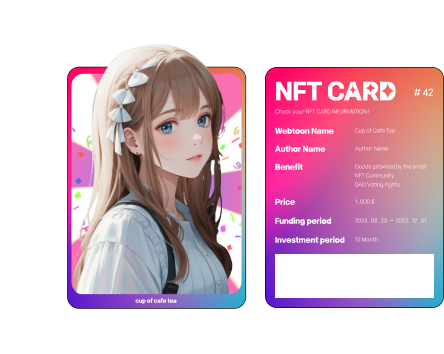

# Moonlyt

  

"The 'Moonlyt' project is a novel platform designed for webtoon enthusiasts and creators with unique flair.

## Docs
https://docs.moonlyt.net

## Demo Site
https://moonlyt.vercel.app/

 

# Tokenomics

### **Revenue Redistribution Mechanism**

Revenues generated from the works (such as usage on external platforms or utilization as derivative works) are used to purchase MYLT tokens, which are then fairly distributed among NFT-holding investors and authors.

### **Token Scarcity and Value Appreciation**

The total quantity of tokens is limited, ensuring their scarcity. As revenue from content within the Moonlyt platform increases, the value of the tokens has the potential to rise.

### **Opportunities for Reinvestment and Sustained Interest**

This system offers attractive reinvestment opportunities for investors and fosters continued interest and investment in the authors' creations.

### **A New Model for Revenue Sharing**

The approach of "Moonlyt" is designed to directly benefit creators and investors from the commercial success of the works, presenting a new model of revenue sharing in the webtoon industry.

### **Promoting Sustainable Growth**

This system enhances the creative drive of authors and offers valuable investment opportunities for investors, thereby fostering sustainable growth in the webtoon industry.
 
 

